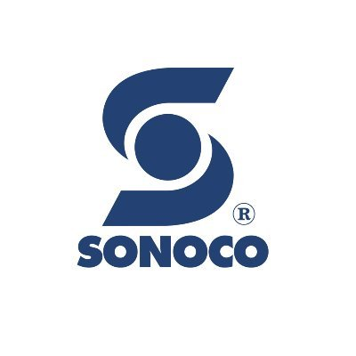
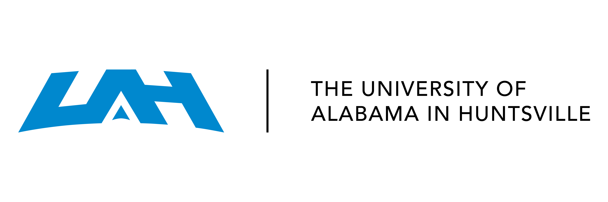

  

  
  
    

**`Mechanical by day, Software by night, Maker 24/7`**

At night & weekend, I'm the creator and maintainer of the **Comfy Project**.

This includes (but not limited to):

- [**ComfySpace**](https://comfystudio.tech/): A minimal Raspberry Pi development framework & cross-platform application meant to increase iteration time and project sharability.
- [**ComfyScript**](https://github.com/ThomasVuNguyen/ComfyScript): A bash scripting tool to reduce boiler-plate code & increase productivity for Rapsberry Pi development by controlling any component in 1 line of code (instead of 100+ lines traditionally). 
- [**ComfyDoc**](https://comfystudio.tech/): The documentation for the overall Comfy project.
- [**ComfyShare**](https://github.com/ThomasVuNguyen/ComfyShare): Github for Comfy/Raspberry Pi projects. This will help maintain and automate sharing and using community projects, tailored for robotic, hardware, and all IoT projects.
- [**ComfyRobo**](https://github.com/ThomasVuNguyen/ComfyRobo): A set of reusable & easy-to-create mechanical components. Think of Legos for Raspberry Pi projects.

Needless to say, I'm passionate about Raspberry Pi. The open-source nature and great stability has created an amazing community. I'm hoping to make that even better.

During the day, I'm working as an [**MEP Engineer**](https://rgdengineers.com/) and [**Electronics & Product Designer**](https://www.coreprototyping.xyz/who-we-are).

**`Projects supporting`**

I'm currently running [*World Community Grid - Cancer Marker Mapping*](https://www.worldcommunitygrid.org/) on my computer to help with cancer research.

**`Having worked at`**

  
  

**`2024 Goals`**

- Shake hands with Eben Upton - Raspberry Pi CEO
- Learn content creation from Jeef Geerling - The closet thing to a Life Style Raspberry Pi Youtuber
- Talk business development with Lady Ada - Adafruit CEO, inspiration for how I run Comfy

**`FAQ`**

Want to learn some Raspberry Pi projects?

Check out my [YT channel](https://www.youtube.com/@thomasthemaker)

Want to have use, contribute or just curious about my work?

Shoot me an email at tungvunguyennguyen@gmail.com

 Want to talk business?

The Comfy Project is not legally a business (yet), but email me at tungvunguyennguyen@gmail.com

### Languages and Tools

 

